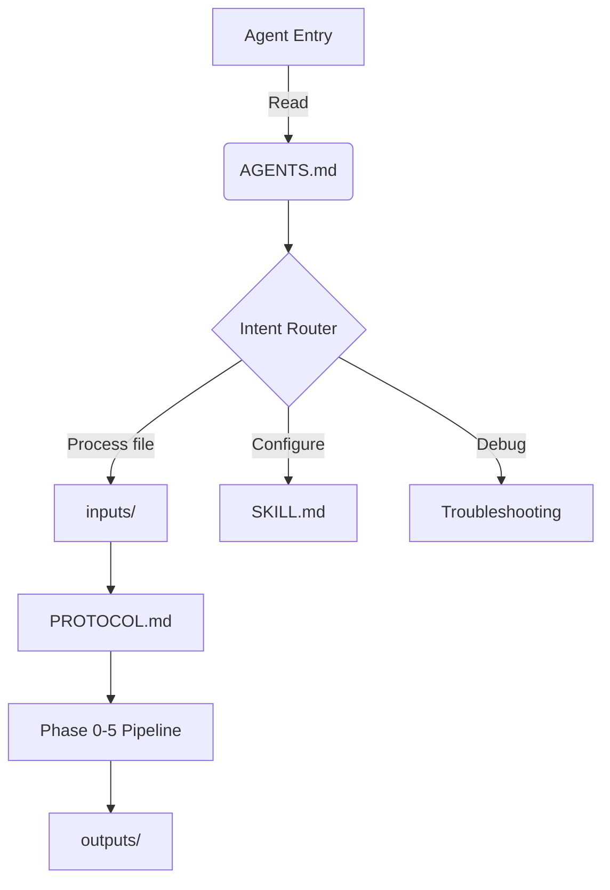

# 🧭 Agent Navigation — TITAN FUSE Protocol

> **Your likely intent:**
> - [ ] Process a large file → jump to [Quick Start](#quick-start)
> - [ ] Understand architecture → jump to [Protocol Architecture](#protocol-architecture)
> - [ ] Configure agent behavior → jump to [Configuration](#configuration)
> - [ ] Debug an issue → jump to [Troubleshooting](#troubleshooting)
> - [ ] Extend the protocol → jump to [Extending](#extending)

---

## Quick Start

```bash
# 1. Assemble the protocol
./scripts/assemble_protocol.sh

# 2. Place input files
cp your-large-file.md inputs/

# 3. Agent reads SKILL.md → PROTOCOL.md → processes inputs/
```

**Key files to read in order:**
1. `SKILL.md` — Agent configuration and constraints
2. `PROTOCOL.md` — Full protocol specification
3. `config.yaml` — Runtime defaults

---

## Navigation Matrix

| Your Intent | File | Section/Command |
|-------------|------|-----------------|
| Start processing | `README.md` | `#quick-start` |
| Understand TIER structure | `PROTOCOL.md` | `#tier-structure` |
| Check verification gates | `PROTOCOL.md` | `#verification-gates` |
| Configure session limits | `config.yaml` | `session:` |
| Add custom validator | `skills/validators/` | Create `.js` file |
| Resume interrupted session | `checkpoints/` | Load `checkpoint.json` |
| Check protocol version | `VERSION` | Read file |
| View changelog | `CHANGELOG.md` | Full file |
| Multi-agent orchestration | `src/agents/multi_agent_orchestrator.py` | Full file |
| SCOUT roles matrix | `src/agents/scout_matrix.py` | Full file |
| Agent communication | `src/agents/agent_protocol.py` | Full file |
| Observability metrics | `src/observability/` | Module directory |
| Planning & DAG | `src/planning/` | Module directory |

---

## Protocol Architecture



### TIER Structure

| Tier | Name | Purpose | Key File |
|------|------|---------|----------|
| -1 | Bootstrap | Repository navigation, self-init | `PROTOCOL.ext.md` |
| 0 | Invariants | Non-negotiable rules | `PROTOCOL.base.md` |
| 1 | Core Principles | Deterministic execution | `PROTOCOL.base.md` |
| 2 | Execution Protocol | Phase 0-5 pipeline | `PROTOCOL.base.md` |
| 3 | Output Format | Mandatory structure | `PROTOCOL.base.md` |
| 4 | Rollback Protocol | Backup and recovery | `PROTOCOL.base.md` |
| 5 | Failsafe Protocol | Edge case handling | `PROTOCOL.base.md` |
| 6 | Verification Gates | GATE-00 through GATE-05 | `PROTOCOL.base.md` |
| 7 | Production (STABLE) | Multi-agent, observability, planning | `src/agents/`, `src/planning/` |

> **Note**: TIER_7 status is STABLE. All 20/20 exit criteria passed. See `docs/tiers/TIER_7_EXIT_CRITERIA.md` for details.

---

## Configuration

### Session Limits (from `config.yaml`)

| Constraint | Default Value |
|------------|---------------|
| Max tokens per session | 100,000 |
| Max time per session | 60 minutes |
| Max files per session | 3 |
| Default chunk size | 1,500 lines |

### Override in `SKILL.md`

```yaml
constraints:
  max_files_per_session: 5
  max_tokens_per_session: 150000
```

---

## Troubleshooting

| Symptom | Check | Fix |
|---------|-------|-----|
| Agent ignores SKILL.md | File name | Must be exactly `SKILL.md` |
| GATE-04 BLOCK | Gap count | Fix SEV-1/SEV-2 issues first |
| Checkpoint rejected | Source file | Use partial recovery |
| Budget exceeded | Token count | Increase in config.yaml |

**Full troubleshooting:** `README.md#troubleshooting`

---

## Extending

### Add Custom Validator

```javascript
// skills/validators/my-validator.js
module.exports = {
  name: 'my-validator',
  version: '1.0.0',
  validate(content, context) {
    return { valid: true, violations: [] };
  }
};
```

### Add Navigation Shortcut

Edit `.ai/shortcuts.yaml`:
```yaml
shortcuts:
  "my_task":
    action: "custom_action"
    files: ["path/to/file.md"]
```

---

## Critical Constraints

```
⛔ NEVER:
├─ Bypass verification gates (GATE-00 through GATE-05)
├─ Modify files marked with <!-- KEEP -->
├─ Skip TIER 0 invariants (INVAR-01 through INVAR-04)
├─ Process binary files directly
└─ Exceed session budget without approval

✅ ALWAYS:
├─ Read SKILL.md before PROTOCOL.md
├─ Create checkpoint after each batch
├─ Mark gaps explicitly: [gap: reason]
└─ Log all changes in CHANGE_LOG.md
```

---

## File Reference

```
titan-protocol/
├── AGENTS.md              ← YOU ARE HERE
├── README.md              ← Human-friendly overview
├── SKILL.md               ← Agent configuration
├── PROTOCOL.md            ← Full protocol (assembled)
├── PROTOCOL.base.md       ← TIER 0-6 base
├── PROTOCOL.ext.md        ← TIER -1 extension
├── config.yaml            ← Runtime defaults
├── VERSION                ← Semantic version
├── CHANGELOG.md           ← Version history
├── inputs/                ← Files to process
├── outputs/               ← Generated artifacts
├── checkpoints/           ← Session persistence
├── skills/validators/     ← Custom validators
├── scripts/               ← Utility scripts
├── .ai/                   ← Agent navigation files
│   ├── nav_map.json
│   ├── context_hints.md
│   ├── shortcuts.yaml
│   └── agent_interface.md
└── .agentignore           ← Files to skip
```

---

## Semantic Index

For machine-readable navigation, see: `.ai/nav_map.json`

Quick lookup:
- `verification_gates` → GATE-00..05 in `PROTOCOL.md`
- `chunking` → PRINCIPLE-04 in `PROTOCOL.base.md`
- `rollback` → TIER 4 in `PROTOCOL.base.md`
- `failsafe` → TIER 5 in `PROTOCOL.base.md`
- `gates`, `validation`, `checks` → all alias to `verification_gates`

---

**Protocol Version:** See `VERSION` file
**Maintainer:** TITAN FUSE Team
**Full Documentation:** `PROTOCOL.md`

