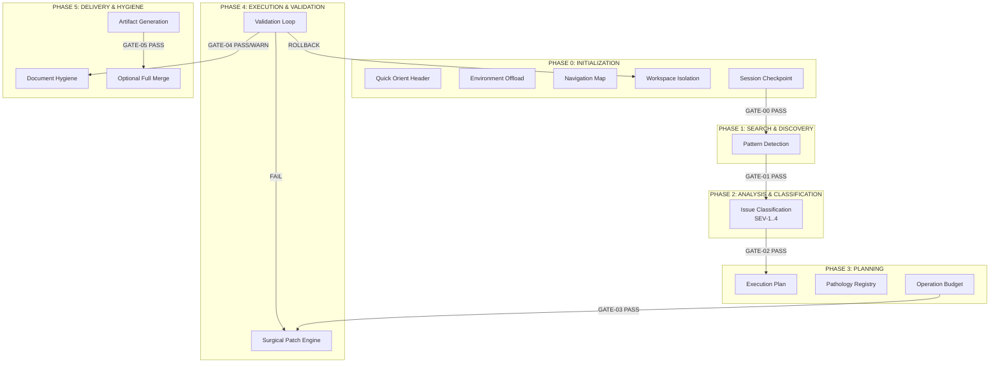
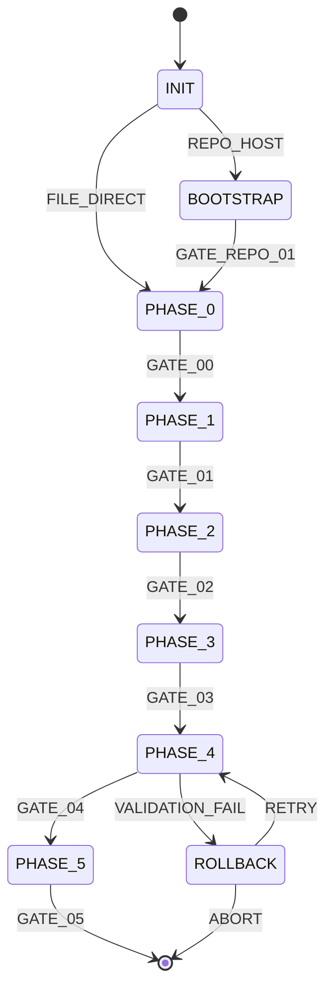
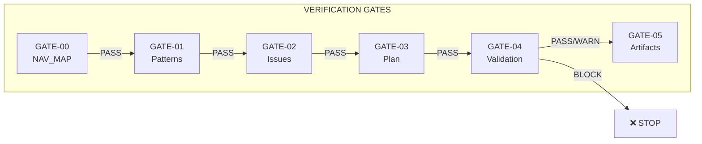

# TITAN FUSE Protocol

**Production-Grade Large-File Agent Protocol v3.2.1**

A deterministic LLM agent protocol for processing large files (5k–50k+ lines) with verification gates, rollback safety, and session persistence.

---

## Quick Start

```bash
# Clone the repository
git clone https://github.com/your-org/titan-protocol.git
cd titan-protocol

# Assemble the protocol
./scripts/assemble_protocol.sh

# Place input files
cp your-large-file.md inputs/

# Run the agent (example - actual implementation depends on your LLM platform)
# The agent will read PROTOCOL.md, SKILL.md, and process files in inputs/
```

---

## Features

### Core Capabilities
- **Large File Processing**: Handle files up to 50k+ lines via chunking
- **Deterministic Execution**: Every action is verifiable and traceable
- **Session Persistence**: Resume interrupted sessions via checkpoints
- **Anti-Fabrication**: Hard invariants prevent hallucination
- **Zero-Drift Guarantee**: Preserve original formatting and structure

### TIER -1 Bootstrap (NEW in v3.0)
- Repository navigation and self-initialization
- Entry point classification (repo URL, file path, repomix)
- Git-backed rollback points
- Multi-file coordination stub

### Enhanced Features (NEW in v3.2)
- **Chunk-level checkpoint recovery**: Resume even after source file changes
- **Enhanced llm_query fallback**: 4-attempt progressive fallback chain
- **Metrics export**: JSON output for monitoring integration
- **Custom validators**: Extensible validation framework

### New Modules (NEW in v3.2.1)
- **FILE_INVENTORY**: File metadata collection before chunking (binary detection, encoding, checksums)
- **CURSOR_TRACKING**: Enhanced position tracking with offset delta
- **ISSUE_DEPENDENCY_GRAPH**: DAG for issue dependencies with topological ordering
- **CROSSREF_VALIDATOR**: Reference validation module (section, anchor, code, import refs)
- **DIAGNOSTICS_MODULE**: Systematic troubleshooting (Symptom → Root Cause → Solution matrix)

---

## Repository Structure

```
titan-protocol/
├── AGENTS.md               # 🧭 Agent entry point (NEW)
├── AI_MISSION.md           # System prompt bridge (NEW)
├── PROTOCOL.md             # Assembled protocol (generated)
├── PROTOCOL.base.md        # Base protocol (TIER 0-6)
├── PROTOCOL.ext.md         # TIER -1 extension
├── SKILL.md                # Agent configuration
├── README.md               # This file
├── VERSION                 # Semantic version
├── CHANGELOG.md            # Version history
├── config.yaml             # Configurable defaults
├── inputs/                 # Files to process
│   └── README.md
├── outputs/                # Generated artifacts
├── checkpoints/            # Session persistence
│   └── checkpoint.schema.json
├── skills/
│   ├── validators/         # Custom validation rules
│   │   ├── no-todos.js
│   │   ├── api-version.js
│   │   └── security.js
│   └── templates/          # Output templates
├── examples/
│   ├── small/              # <5000 line examples
│   └── large/              # >5000 line examples
├── scripts/
│   ├── assemble_protocol.sh
│   ├── validate_checkpoint.py
│   ├── enhanced_llm_query.py
│   ├── generate_metrics.py
│   └── test_navigation.py  # Navigation tests (NEW)
├── .ai/                    # Agent navigation files (NEW)
│   ├── nav_map.json
│   ├── context_hints.md
│   ├── shortcuts.yaml
│   └── agent_interface.md
├── .agentignore            # Files to skip (NEW)
├── DECISION_TREE.json      # State machine (NEW)
└── .titan_index.json       # Semantic index (NEW)
```

---

## Protocol Architecture

### TIER Structure

| Tier | Name | Purpose |
|------|------|---------|
| -1 | Bootstrap | Repository navigation, self-initialization |
| 0 | Invariants | Non-negotiable rules (anti-fabrication, zero-drift) |
| 1 | Core Principles | Deterministic execution, tool-first navigation |
| 2 | Execution Protocol | Phased processing (Phase 0-5) |
| 3 | Output Format | Mandatory structure and artifacts |
| 4 | Rollback Protocol | Backup and recovery |
| 5 | Failsafe Protocol | Edge case handling |
| 6 | Verification Gates | GATE-00 through GATE-05 |

### Processing Pipeline



### State Machine



---

## Verification Gates



| Gate | Condition | On Fail |
|------|-----------|---------|
| GATE-00 | NAV_MAP exists, all chunks indexed | BLOCK |
| GATE-01 | All target patterns scanned | BLOCK |
| GATE-02 | All issues classified with ISSUE_ID | BLOCK |
| GATE-03 | Plan validated, no KEEP_VETO violations | BLOCK |
| GATE-04 | Validations pass OR gaps within threshold | BLOCK/WARN |
| GATE-05 | All artifacts generated, hygiene complete | BLOCK |

### GATE-04 Threshold Rules

- **BLOCK**: SEV-1 gaps > 0, SEV-2 gaps > 2, or total gaps > 20%
- **WARN**: SEV-3 gaps > 5, SEV-4 gaps > 10
- **PASS**: All above conditions false

---

## Agent Navigation (NEW)

For LLM agents, the repository now includes navigation aids:

| File | Purpose |
|------|---------|
| `AGENTS.md` | Entry point with navigation matrix |
| `AI_MISSION.md` | System prompt for LLM context |
| `.ai/nav_map.json` | Semantic index with aliases |
| `.ai/context_hints.md` | STOP/PROCEED/GO signals |
| `.ai/shortcuts.yaml` | Zero-click navigation shortcuts |
| `.ai/agent_interface.md` | Command specification |
| `DECISION_TREE.json` | State machine definition |

**For agents:** Start with `AGENTS.md`, then read `SKILL.md`.

---

## Configuration

### SKILL.md

Override protocol defaults in `SKILL.md`:

```yaml
---
skill_version: 2.1.0
protocol_version: 3.2.1
constraints:
  max_files_per_session: 3
  max_tokens_per_session: 100000
---
```

### config.yaml

Configure runtime defaults:

```yaml
session:
  max_tokens: 100000
  max_time_minutes: 60

chunking:
  default_size: 1500

llm_query:
  fallback_enabled: true
```

---

## Custom Validators

Create validators in `skills/validators/`:

```javascript
// skills/validators/my-validator.js
module.exports = {
  name: 'my-validator',
  version: '1.0.0',

  validate(content, context) {
    // Return { valid: boolean, violations: [] }
  }
};
```

Validators are auto-loaded during Phase 2.

---

## Checkpoint Recovery

### Resume Full Session

```bash
python scripts/validate_checkpoint.py checkpoints/checkpoint.json
# Status: VALID → Full resumption possible
```

### Partial Recovery

When source file changed:

```bash
python scripts/validate_checkpoint.py checkpoints/checkpoint.json
# Status: PARTIAL → Some chunks recoverable
# Recoverable Chunks: C1, C2, C3
# Lost Chunks: C4, C5
```

---

## Navigation Tests

Run navigation integrity tests:

```bash
python scripts/test_navigation.py
# Tests: AGENTS.md, nav_map.json, shortcuts.yaml, internal links
```

---

## Metrics Integration

The protocol generates `metrics.json` for monitoring:

```json
{
  "session": {
    "id": "uuid",
    "duration_seconds": 1847,
    "status": "COMPLETE"
  },
  "processing": {
    "issues_found": 47,
    "issues_fixed": 42,
    "gaps": 2
  },
  "gates": {
    "GATE-00": "PASS",
    "GATE-04": "WARN"
  }
}
```

---

## Troubleshooting

| Symptom | Cause | Fix |
|---------|-------|-----|
| Agent ignores SKILL.md | Wrong filename | Use exactly `SKILL.md` |
| inputs/ not visible | Empty directory | Add `.gitkeep` |
| Checkpoint rejected | Source file changed | Use partial recovery or fresh start |
| GATE-04 BLOCK | Too many gaps | Fix critical issues first |
| Budget exceeded | Token limit reached | Increase budget in config |
| llm_query timeout | Chunk too large | Use smaller chunk size |
| Circular dependency | Files reference each other | Process in queue order |
| gh CLI not found | Not installed | Use git manually or install gh |
| Version mismatch | Protocol > agent version | Update agent or use older protocol |
| Navigation test fails | Missing AGENTS.md | Run from repo root |

---

## Contributing

1. Fork the repository
2. Create a feature branch
3. Run validation: `./scripts/assemble_protocol.sh && python scripts/validate_checkpoint.py`
4. Run navigation tests: `python scripts/test_navigation.py`
5. Submit a pull request

---

## License

MIT License - See LICENSE file for details.

---

## Version History

| Version | Date | Highlights |
|---------|------|------------|
| 3.2.1 | 2026-04-07 | FILE_INVENTORY, CURSOR_TRACKING, ISSUE_DEPENDENCY_GRAPH, CROSSREF_VALIDATOR, DIAGNOSTICS_MODULE |
| 3.2.0 | 2024-01-15 | Chunk-level recovery, enhanced llm_query, metrics |
| 3.1.0 | 2024-01-01 | Session persistence, budget tracking |
| 3.0.0 | 2023-12-15 | TIER -1 Bootstrap, environment offload |
| 2.0.0 | 2023-11-01 | Patch engine, validation loop |
| 1.0.0 | 2023-10-01 | Initial release |

---

**Protocol Status**: EARLY_ADOPTER

> ⚠️ **Adoption Notice**: This protocol is in EARLY_ADOPTER stage. Architecture is sound but requires:
> - Passing all Tier 1 fixes (see AUDIT_REPORT.md)
> - Verified integration with target LLM platform
> - Minimum one full checkpoint recovery test
> - Independent audit or validation signals
>
> **Use when**: Files >5000 lines, deterministic output required, human-in-the-loop validation available.
> **Use alternatives when**: Simple file processing (<1000 lines), rapid prototyping, automatic execution without gates.

**Maintainer**: TITAN FUSE Team

**Documentation**: Full protocol specification in `PROTOCOL.md`

**Agent Entry Point**: `AGENTS.md`

