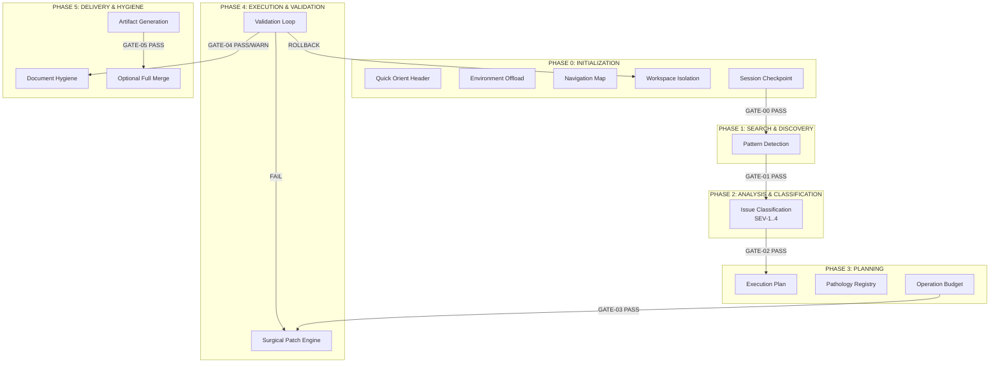
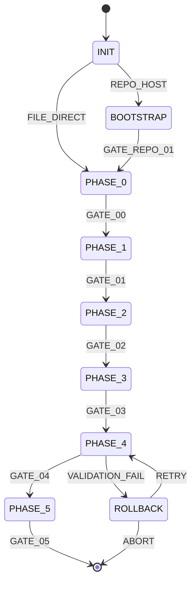
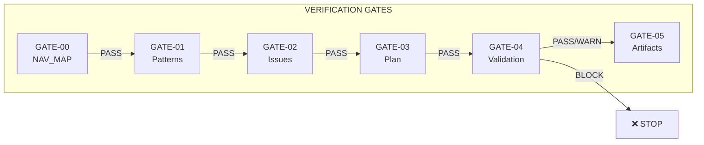

<!-- version-header -->
# TITAN FUSE Protocol

**Production-Grade Large-File Agent Protocol v5.3.0**

A deterministic LLM agent protocol for processing large files (5k–50k+ lines) with verification gates, rollback safety, and session persistence.

<!-- AGENT_METADATA:start -->
```yaml
entry_point: AGENTS.md
nav_graph: .ai/nav_map.json
config: config.yaml
version_file: ./VERSION
validation_gates: [GATE-00, GATE-01, GATE-02, GATE-03, GATE-04, GATE-05]
tier_status: TIER_7_STABLE
test_count: 3117+
python_version: ">=3.10"
```
<!-- AGENT_METADATA:end -->

<!-- badges -->


---

## Project Scale

| Metric | Value |
|--------|-------|
| Python Modules | 175 files |
| Lines of Code | 73,800+ |
| Test Coverage | 3,117+ tests |
| Architecture Tiers | 8 (TIER -1..7) |
| Production Status | TIER_7_STABLE |

---

## Requirements

```yaml
requirements:
  python: ">=3.10"
  node: ">=18"  # for JS validators
  cli_tools: [gh, git, python3]
  env_vars: [TITAN_API_KEY, TITAN_TOKEN_LIMIT]
```

---

## Quick Start

```bash
# Clone the repository
git clone https://github.com/vudirvp-sketch/titan-protocol.git
cd titan-protocol

# Assemble the protocol
./scripts/assemble_protocol.sh

# Place input files
cp your-large-file.md inputs/

# Run the agent (example - actual implementation depends on your LLM platform)
# The agent will read PROTOCOL.md, SKILL.md, and process files in inputs/
```

---

## Features

### Core Capabilities
- **Large File Processing**: Handle files up to 50k+ lines via chunking
- **Deterministic Execution**: Every action is verifiable and traceable
- **Session Persistence**: Resume interrupted sessions via checkpoints
- **Anti-Fabrication**: Hard invariants prevent hallucination
- **Zero-Drift Guarantee**: Preserve original formatting and structure

### TIER -1 Bootstrap (NEW in v3.0)
- Repository navigation and self-initialization
- Entry point classification (repo URL, file path, repomix)
- Git-backed rollback points
- Multi-file coordination stub

### Enhanced Features (NEW in v3.2)
- **Chunk-level checkpoint recovery**: Resume even after source file changes
- **Enhanced llm_query fallback**: 4-attempt progressive fallback chain
- **Metrics export**: JSON output for monitoring integration
- **Custom validators**: Extensible validation framework

### New Modules (NEW in v3.2.1)
- **FILE_INVENTORY**: File metadata collection before chunking (binary detection, encoding, checksums)
- **CURSOR_TRACKING**: Enhanced position tracking with offset delta
- **ISSUE_DEPENDENCY_GRAPH**: DAG for issue dependencies with topological ordering
- **CROSSREF_VALIDATOR**: Reference validation module (section, anchor, code, import refs)
- **DIAGNOSTICS_MODULE**: Systematic troubleshooting (Symptom → Root Cause → Solution matrix)

### TIER 7 Production Features (NEW in v4.1.0)
- **Planning DAG**: CycleDetector prevents infinite loops in execution plans
- **Amendment Control**: GATE-PLAN and GATE-AMENDMENT enforcement
- **Multi-Agent Orchestration**: SCOUT roles (RADAR/DEVIL/EVAL/STRAT) for quality assurance
- **Observability**: OpenTelemetry tracing, structured logging, token attribution
- **Production Ready**: 1100+ tests, security hardening, checkpoint isolation

---

## Repository Structure

```
titan-protocol/
├── AGENTS.md               # 🧭 Agent entry point (NEW)
├── AI_MISSION.md           # System prompt bridge (NEW)
├── PROTOCOL.md             # Assembled protocol (generated)
├── PROTOCOL.base.md        # Base protocol (TIER 0-6)
├── PROTOCOL.ext.md         # TIER -1 extension
├── SKILL.md                # Agent configuration
├── README.md               # This file
├── VERSION                 # Semantic version
├── CHANGELOG.md            # Version history
├── config.yaml             # Configurable defaults
├── inputs/                 # Files to process
│   └── README.md
├── outputs/                # Generated artifacts
├── checkpoints/            # Session persistence
│   └── checkpoint.schema.json
├── skills/
│   ├── validators/         # Custom validation rules
│   │   ├── no-todos.js
│   │   ├── api-version.js
│   │   └── security.js
│   └── templates/          # Output templates
├── examples/
│   ├── small/              # <5000 line examples
│   └── large/              # >5000 line examples
├── scripts/
│   ├── assemble_protocol.sh
│   ├── validate_checkpoint.py
│   ├── enhanced_llm_query.py
│   ├── generate_metrics.py
│   └── test_navigation.py  # Navigation tests (NEW)
├── .ai/                    # Agent navigation files (NEW)
│   ├── nav_map.json
│   ├── context_hints.md
│   ├── shortcuts.yaml
│   └── agent_interface.md
├── .agentignore            # Files to skip (NEW)
├── DECISION_TREE.json      # State machine (NEW)
└── .titan_index.json       # Semantic index (NEW)
```

---

## Protocol Architecture

### TIER Structure

| Tier | Name | Purpose | Key Modules |
|------|------|---------|-------------|
| -1 | Bootstrap | Repository navigation, self-initialization | PROTOCOL.ext.md |
| 0 | Invariants | Non-negotiable rules (anti-fabrication, zero-drift) | PROTOCOL.base.md |
| 1 | Core Principles | Deterministic execution, tool-first navigation | PROTOCOL.base.md |
| 2 | Execution Protocol | Phased processing (Phase 0-5) | orchestrator.py |
| 3 | Output Format | Mandatory structure and artifacts | src/output/ |
| 4 | Rollback Protocol | Backup and recovery | checkpoint_manager.py |
| 5 | Failsafe Protocol | Edge case handling | recovery_manager.py |
| 6 | Verification Gates | GATE-00 through GATE-05 | guardian.py |
| 7 | Production | Multi-agent, observability, planning | multi_agent_orchestrator.py, cycle_detector.py |

> **Note**: TIER_7 status is STABLE. All 20/20 exit criteria passed. See `docs/tiers/TIER_7_EXIT_CRITERIA.md` for details.

### Processing Pipeline



### Phase Mapping (Legacy → Current)

The pipeline phases have been renamed to align with `src/pipeline/phases.py`:

| Legacy Name | Current Name | Description |
|-------------|--------------|-------------|
| Phase 0: Bootstrap | INIT | Initialization, workspace setup |
| Phase 1: Intent Classification | DISCOVER | Pattern detection, search |
| Phase 2: Analysis & Skill Selection | ANALYZE | Issue classification, SEV rating |
| Phase 3: Synthesis & Tool Resolution | PLAN | Execution plan, budget allocation |
| Phase 4: Validation & Gating | EXEC | Surgical patches, validation loop |
| Phase 5: Output & Audit | DELIVER | Hygiene, artifact generation |

> **Source of Truth**: `src/pipeline/phases.py` defines `PipelinePhase` enum.

### State Machine



---

## Verification Gates



| Gate | Condition | On Fail |
|------|-----------|---------|
| GATE-00 | NAV_MAP exists, all chunks indexed | BLOCK |
| GATE-01 | All target patterns scanned | BLOCK |
| GATE-02 | All issues classified with ISSUE_ID | BLOCK |
| GATE-03 | Plan validated, no KEEP_VETO violations | BLOCK |
| GATE-04 | Validations pass OR gaps within threshold | BLOCK/WARN |
| GATE-05 | artifacts-generated AND metrics.json-valid AND audit_trail.sig-verified | BLOCK |

### GATE-04 Threshold Rules

- **BLOCK**: SEV-1 gaps > 0, SEV-2 gaps > 2, or total gaps > 20%
- **WARN**: SEV-3 gaps > 5, SEV-4 gaps > 10
- **PASS**: All above conditions false

---

## Security

### Invariants (Non-Negotiable)

| ID | Name | Enforcement |
|----|------|-------------|
| INVAR-01 | Anti-Fabrication | `[gap: not in sources]` for missing data |
| INVAR-02 | S-5 VETO | `<!-- KEEP -->` blocks modification |
| INVAR-03 | Zero-Drift | Preserve formatting, structure, tone |
| INVAR-04 | Patch Idempotency | Same result on re-application |
| INVAR-05 | Code Execution Gate | sandbox/human_gate required |

### Security Modules → Invariants Mapping

| Module | Purpose | INVAR Enforcement |
|--------|---------|-------------------|
| `src/security/secret_scanner.py` | AWS/GitHub/API key detection | INVAR-05 (Code Execution Gate) |
| `src/security/workspace_isolation.py` | Sandboxed file operations | INVAR-02 (S-5 Veto), INVAR-05 |
| `src/security/sandbox_verifier.py` | Runtime sandbox health check | INVAR-05 |
| `src/security/execution_gate.py` | LLM code execution control | INVAR-05 |
| `src/security/input_sanitizer.py` | Input validation | INVAR-01 (Anti-Fabrication) |
| `src/security/session_security.py` | Session protection | — |
| `src/state/checkpoint_serialization.py` | JSON+zstd default, pickle requires `--unsafe` | INVAR-05 |

### Execution Gate Configuration

```yaml
# config.yaml
execution:
  mode: sandbox | human_gate | disabled
  sandbox_type: docker | venv | restricted_subprocess | none
  timeout_ms: 10000
  max_memory_mb: 128
```

---

## Multi-Agent Architecture

### SCOUT Roles Matrix

The SCOUT pipeline provides multi-perspective quality assurance:

| Role | Function | Trigger | Output |
|------|----------|---------|--------|
| RADAR | Signal detection | All tasks | Issue candidates |
| DEVIL | Adversarial review | EVALUATE, COMPARE, AUDIT | Risk assessment |
| EVAL | Quality veto | EXPERIMENTAL, VAPORWARE detection | Pass/Fail decision |
| STRAT | Strategic synthesis | Final recommendation | Action plan |

### SCOUT Pipeline Flow

```
RADAR → DEVIL → EVAL → STRAT
  │        │       │       │
  │        │       └─── VETO (blocks STRAT if quality threshold not met)
  │        └─────────── Challenge findings, identify edge cases
  └──────────────────── Detect signals, patterns, anomalies
```

### Veto Mechanism

EVAL has veto power:
- If EVAL returns `veto=True`, STRAT is blocked
- Veto conditions: low confidence, experimental code, security risk
- Veto audit trail logged for review

### Integration with Verification Gates

SCOUT integrates with GATE-04:
- RADAR runs during DISCOVER phase
- DEVIL challenges during ANALYZE phase
- EVAL validates before EXEC phase
- STRAT synthesizes for DELIVER phase

### Modules

- `src/agents/multi_agent_orchestrator.py` — TaskQueue, AgentRegistry, conflict resolution
- `src/agents/scout_matrix.py` — RADAR/DEVIL/EVAL/STRAT pipeline
- `src/agents/agent_protocol.py` — Communication protocol
- `src/skills/skill_library.py` — YAML catalog with synergy tracking

---

## Observability

### Modules

| Module | Purpose | Key Features |
|--------|---------|--------------|
| `src/observability/distributed_tracing.py` | OpenTelemetry integration | W3C TraceContext, span hierarchy |
| `src/observability/structured_logging.py` | JSON logging | Component-level levels, correlated IDs |
| `src/observability/realtime_metrics.py` | Latency metrics | p50/p95/p99 percentiles |
| `src/observability/token_attribution.py` | Token tracking | Per-gate attribution, budget monitoring |
| `src/observability/budget_forecast.py` | Predictive warnings | Token velocity, proactive alerts |
| `src/observability/agent_metrics_collector.py` | Agent metrics | Task counts, success rates |
| `src/observability/span_tracker.py` | Span management | Lifecycle tracking, parent-child relations |

### Configuration

```yaml
observability:
  tracing:
    enabled: true
    provider: opentelemetry
    sampling_rate: 1.0
  structured_logging:
    enabled: true
    format: json
    level: INFO
  metrics:
    export_interval_seconds: 60
    percentiles: [0.5, 0.95, 0.99]
```

### Prometheus Integration

Metrics are exposed at `/metrics` endpoint when `prometheus_enabled: true`:

```
# HELP titan_tokens_total Total tokens consumed per gate
# TYPE titan_tokens_total counter
titan_tokens_total{gate="GATE-00"} 1234
titan_tokens_total{gate="GATE-04"} 5678

# HELP titan_latency_seconds Request latency percentiles
# TYPE titan_latency_seconds summary
titan_latency_seconds{quantile="0.5"} 0.129
titan_latency_seconds{quantile="0.95"} 0.258
```

---

## State Management

### Components

| Module | Purpose |
|---------|---------|
| `src/state/state_manager.py` | Central state coordination |
| `src/state/checkpoint_manager.py` | Checkpoint lifecycle (create, validate, restore) |
| `src/state/checkpoint_compression.py` | zstd/gzip compression for checkpoints |
| `src/state/checkpoint_serialization.py` | JSON+zstd default, pickle requires `--unsafe` |
| `src/state/event_sourcing.py` | Event sourcing for state reconstruction |
| `src/state/event_journal.py` | WAL for crash recovery |
| `src/state/recovery.py` | Recovery procedures and policies |
| `src/state/drift_policy.py` | External state drift handling (FAIL/CLOBBER/MERGE/BRANCH) |
| `src/state/cursor.py` | Position tracking for chunk processing |

### Checkpoint Format

```json
{
  "session_id": "<uuid>",
  "protocol_version": "5.3.0",
  "source_checksum": "<sha256>",
  "gates_passed": ["GATE-00", "GATE-01"],
  "completed_batches": ["BATCH_001"],
  "chunk_cursor": "C3",
  "recursion_depth": 0,
  "max_recursion_depth": 1,
  "cursor_state": {
    "current_file": "<path>",
    "current_line": 1234,
    "offset_delta": 0
  }
}
```

### Recovery Modes

- **FULL**: Complete session resumption (checksum match required)
- **PARTIAL**: Some chunks recoverable (source changed)
- **FRESH**: Start new session (checkpoint invalid)

---

## Event System

### Components

| Module | Purpose |
|---------|---------|
| `src/events/event_bus.py` | Central event dispatch and routing |
| `src/events/dead_letter_queue.py` | Failed event recovery with retry |
| `src/events/audit_trail.py` | Audit logging for compliance |
| `src/events/audit_signer.py` | HMAC/RSA/Ed25519/KMS signing |
| `src/events/causal_ordering.py` | Lamport/Vector clocks for ordering |
| `src/events/gap_event.py` | Gap event handling and serialization |
| `src/events/context_events.py` | Context lifecycle events |

### Event Types

```python
# From schemas/event_types.schema.json
EVENT_TYPES = [
    "SESSION_START", "SESSION_END",
    "PHASE_ENTER", "PHASE_EXIT",
    "GATE_PASS", "GATE_FAIL", "GATE_WARN",
    "CHUNK_START", "CHUNK_END",
    "PATCH_APPLY", "PATCH_SKIP",
    "GAP_DETECTED", "GAP_RESOLVED",
    "CHECKPOINT_CREATE", "CHECKPOINT_RESTORE",
    "PATTERN_REUSED",  # Synergy tracking
]
```

### Audit Signing Options

| Method | Use Case | Performance |
|--------|----------|-------------|
| HMAC | Development, local | Fastest |
| RSA | Production, external verification | Medium |
| Ed25519 | High-security production | Fast |
| KMS | Enterprise, key rotation | Depends on provider |

---

## Planning & DAG

### Components

| Module | Purpose |
|---------|---------|
| `src/planning/planning_engine.py` | Core planning logic, batch creation |
| `src/planning/cycle_detector.py` | DAG infinite loop prevention |
| `src/planning/amendment_control.py` | GATE-PLAN and GATE-AMENDMENT enforcement |
| `src/planning/dag_checkpoint.py` | DAG state persistence for recovery |
| `src/planning/state_snapshot.py` | Pre/post execution state snapshots |

### Cycle Detection

The `CycleDetector` prevents infinite loops in execution plans:

```python
# From src/planning/cycle_detector.py
class CycleDetector:
    def detect_cycle(self, dag: Dict[str, List[str]]) -> Optional[List[str]]:
        """Returns cycle path if detected, None otherwise."""
        # Uses DFS with coloring (WHITE/GRAY/BLACK)
```

### Amendment Control

GATE-PLAN: Validates execution plan before execution
GATE-AMENDMENT: Validates plan changes during execution

```yaml
amendment_control:
  require_approval: true
  audit_changes: true
  max_amendments_per_session: 5
```

---

## LLM Integration

### Provider Adapters

| Adapter | Provider | Features |
|---------|----------|----------|
| `src/llm/adapters/openai.py` | OpenAI GPT | Streaming, function calling |
| `src/llm/adapters/anthropic.py` | Claude | Streaming, extended context |
| `src/llm/adapters/mock.py` | Testing | Deterministic responses |

### Model Routing

```yaml
# config.yaml
model_routing:
  root_model: gpt-4  # For orchestration, planning
  leaf_model: gpt-3.5-turbo  # For chunk analysis
```

### Streaming Support

- Chunk callbacks for progress tracking
- Early termination on validation failure
- Token counting per chunk

### Fallback Policy

```python
# 4-attempt progressive fallback
FALLBACK_CHAIN = [
    "primary_model",
    "alternative_1", 
    "alternative_2",
    "fallback_model"
]
```

### Modules

- `src/llm/adapters/base.py` — Abstract adapter interface
- `src/llm/router.py` — Root/Leaf model routing
- `src/llm/streaming.py` — Chunk callbacks, early termination
- `src/llm/fallback_policy.py` — Fallback chain
- `src/llm/provider_registry.py` — Plugin-based provider registry
- `src/llm/seed_injection.py` — Deterministic seed injection

---

## Context Management

### Context Zones

Content is classified into zones with different retention priorities:

| Zone | Priority | Retention |
|------|----------|-----------|
| CRITICAL | Highest | Always retained |
| OPERATIONAL | High | Retained during session |
| REFERENCE | Medium | Compressed, key info retained |
| ARCHIVE | Low | Summarized or discarded |

### Profile Router

9 context adaptation profiles for different task types:

| Profile | Use Case | Optimization |
|---------|----------|--------------|
| TECHNICAL | Code analysis | Symbol preservation |
| CREATIVE | Content generation | Breadth over depth |
| ANALYTICAL | Data processing | Precision focus |
| AUDIT | Review tasks | Comprehensive coverage |
| DEBUG | Troubleshooting | Error context focus |
| REFACTOR | Code restructuring | Dependency tracking |
| DOCUMENTATION | Doc generation | Clarity priority |
| SECURITY | Security audit | Vulnerability focus |
| PERFORMANCE | Optimization | Metric tracking |

---

## Storage Architecture

### Backend Abstraction

| Backend | Use Case | Configuration |
|---------|----------|---------------|
| `src/storage/local_backend.py` | Development, single-node | `storage.type: local` |
| `src/storage/s3_backend.py` | AWS deployment | `storage.type: s3` |
| `src/storage/gcs_backend.py` | GCP deployment | `storage.type: gcs` |

### Configuration

```yaml
storage:
  type: local  # local | s3 | gcs
  encryption:
    enabled: true
    algorithm: aes-256-gcm
  log_rotation:
    max_size_mb: 100
    keep_count: 10
```

---

## Workflow Presets

Pre-configured workflows for common tasks:

| Preset | Purpose | Location |
|--------|---------|----------|
| validation | Validation workflows | `presets/validation/` |
| code_review | Code review workflows | `presets/code_review/` |
| dependency_audit | Dependency analysis | `presets/dependency_audit/` |
| documentation | Doc generation | `presets/documentation/` |
| debugging | Debug workflows | `presets/debugging/` |
| large_file | Large file processing | `presets/large_file/` |

### Usage

```bash
# Use a preset
titan run --preset code_review inputs/myfile.py

# List available presets
titan presets list
```

---

## CLI Reference

### Main Commands

```bash
# Process a file
titan process inputs/myfile.md

# Resume from checkpoint
titan resume checkpoints/checkpoint.json

# Validate checkpoint
titan validate-checkpoint checkpoints/checkpoint.json

# Run diagnostics
titan doctor

# Generate metrics
titan metrics --output outputs/metrics.json
```

### Migration Commands

```bash
# Migrate checkpoints between versions
titan migrate-checkpoints --from 3.2.2 --to 5.3.0 --dry-run

# Sync versions across files
titan sync-versions
```

---

## Production Features

| Feature | Module | Purpose |
|---------|--------|---------|
| SARIF Output | src/output/sarif_exporter.py | GitHub Code Scanning compatible |
| Interactive Mode | src/interactive/repl.py | REPL debugging, breakpoints, rollback |
| Streaming | src/llm/streaming.py | Chunk callbacks, early termination |
| Dead Letter Queue | src/events/dead_letter_queue.py | Failed event recovery |
| Cycle Detection | src/planning/cycle_detector.py | DAG infinite loop prevention |

---

## Agent Navigation

For LLM agents, the repository now includes navigation aids:

| File | Purpose | Priority |
|------|---------|----------|
| AGENTS.md | Primary LLM entry point | HIGH |
| .ai/nav_map.json | Machine-readable navigation graph | HIGH |
| PROTOCOL.md | Full assembled specification | MEDIUM |
| SKILL.md | Agent configuration v2.1.0 | MEDIUM |
| config.yaml | Runtime defaults | MEDIUM |
| VERSION | Single source of truth | MEDIUM |
| docs/tiers/TIER_7_EXIT_CRITERIA.md | Production readiness gates | LOW |
| CHANGELOG.md | Human history (agent ignores unless --changelog) | LOW |

**For agents:** Start with `AGENTS.md`, use `nav_map.json` for graph traversal.

---

## Migration v3.2.x → v5.3.0

1. Add to `config.yaml`:
   ```yaml
   planning:
     cycle_detection:
       enabled: true
   ```
2. Run migration preview:
   ```bash
   python scripts/migrate_checkpoints.py --from 3.2.2 --to 5.3.0 --dry-run
   ```
3. GATE-PLAN and GATE-AMENDMENT are now enforced
4. Enable observability:
   ```yaml
   observability:
     prometheus_enabled: true
   ```

---

## Version Authority

- **Single Source of Truth**: `./VERSION` file
- **Sync Script**: `scripts/sync_readme_version.py`
- **Check Script**: `scripts/check_version_sync.py --strict`
- **Rule**: No hardcoded versions — use `src/core/version.py::get_version()`
- **Violation**: Hardcoded version = S-5 VETO (invariant breach)

---

## Configuration

### SKILL.md

Override protocol defaults in `SKILL.md`:

```yaml
---
skill_version: 2.1.0
protocol_version: 5.3.0
constraints:
  max_files_per_session: 3
  max_tokens_per_session: 100000
---
```

### config.yaml

Configure runtime defaults:

```yaml
session:
  max_tokens: 100000
  max_time_minutes: 60

chunking:
  default_size: 1500

llm_query:
  fallback_enabled: true
```

---

## Custom Validators

Create validators in `skills/validators/`:

```javascript
// skills/validators/my-validator.js
module.exports = {
  name: 'my-validator',
  version: '1.0.0',

  validate(content, context) {
    // Return { valid: boolean, violations: [] }
  }
};
```

Validators are auto-loaded during Phase 2.

---

## Checkpoint Recovery

### Resume Full Session

```bash
python scripts/validate_checkpoint.py checkpoints/checkpoint.json
# Status: VALID → Full resumption possible
```

### Partial Recovery

When source file changed:

```bash
python scripts/validate_checkpoint.py checkpoints/checkpoint.json
# Status: PARTIAL → Some chunks recoverable
# Recoverable Chunks: C1, C2, C3
# Lost Chunks: C4, C5
```

---

## Navigation Tests

Run navigation integrity tests:

```bash
python scripts/test_navigation.py
# Tests: AGENTS.md, nav_map.json, shortcuts.yaml, internal links
```

---

## Metrics Integration

The protocol generates `metrics.json` for monitoring:

```json
{
  "session": {
    "id": "uuid",
    "duration_seconds": 1847,
    "status": "COMPLETE"
  },
  "processing": {
    "issues_found": 47,
    "issues_fixed": 42,
    "gaps": 2
  },
  "gates": {
    "GATE-00": "PASS",
    "GATE-04": "WARN"
  }
}
```

---

## Troubleshooting

| Symptom | Cause | Fix |
|---------|-------|-----|
| Agent ignores SKILL.md | Wrong filename | Use exactly `SKILL.md` |
| inputs/ not visible | Empty directory | Add `.gitkeep` |
| Checkpoint rejected | Source file changed | Use partial recovery or fresh start |
| GATE-04 BLOCK | Too many gaps | Fix critical issues first |
| Budget exceeded | Token limit reached | Increase budget in config |
| llm_query timeout | Chunk too large | Use smaller chunk size |
| Circular dependency | Files reference each other | Process in queue order |
| gh CLI not found | Not installed | Use git manually or install gh |
| Version mismatch | Protocol > agent version | Update agent or use older protocol |
| Navigation test fails | Missing AGENTS.md | Run from repo root |

---

## Automation

### Pre-Commit Hook

The repository includes a pre-commit configuration for automatic version sync:

```yaml
# .pre-commit-config.yaml (already configured)
repos:
  - repo: local
    hooks:
      - id: version-sync
        name: Check VERSION sync
        entry: bash -c 'python3 scripts/check_version_sync.py --strict'
        language: system
        files: '^(VERSION|README\.md|\.ai/nav_map\.json|\.github/README_META\.yaml)$'
```

### CI Workflow

```yaml
# .github/workflows/sync-readme.yml
on:
  push:
    paths: ['VERSION']
jobs:
  sync:
    runs-on: ubuntu-latest
    steps:
      - uses: actions/checkout@v4
      - run: python scripts/sync_readme_version.py
      - run: python scripts/check_version_sync.py --strict
```

### Post-Update Validation

```yaml
validation_gates:
  GATE-00: [nav_map.json parseable, VERSION file exists, README.md version == VERSION]
  GATE-01: [All #anchor links resolve, All internal refs valid]
  GATE-02: [No hardcoded versions except VERSION file, Badges machine-parseable]
  GATE-03: [Repository structure matches actual files, Clone URL correct]
  GATE-04: [Migration guide includes --dry-run, Requirements block present]
  GATE-05: [metrics.json schema valid, All sections present]
```

---

## Contributing

1. Fork the repository
2. Create a feature branch
3. Run validation: `./scripts/assemble_protocol.sh && python scripts/validate_checkpoint.py`
4. Run navigation tests: `python scripts/test_navigation.py`
5. Submit a pull request

---

## License

MIT License - See LICENSE file for details.

---

## Version History

| Version | Date | Highlights |
|---------|------|------------|
| 5.3.0 | 2026-04-11 | Documentation sync: Phase mapping, SCOUT expanded, Observability 7 modules, Security→INVAR mapping, State/Event/Planning docs, LLM/Context/Storage/Workflow/CLI docs |
| 5.2.0 | 2026-04-11 | TIER_7_STABLE: Canonical patterns schema, ContentPipeline 6-phase, GapEvent serializer, Gap registry, SkillGenerator, Preset workflows |
| 5.1.0 | 2026-04-10 | TIER_7 exit criteria 20/20 passed, 3117+ tests |
| 4.1.0 | 2026-04-08 | TIER_7_IN_PROGRESS: Planning DAG, Amendment Control, CycleDetector, 1100+ tests |
| 3.2.2 | 2026-04-07 | Security hardening, checkpoint isolation, gap objects, secret scanning |
| 3.2.1 | 2026-04-07 | FILE_INVENTORY, CURSOR_TRACKING, ISSUE_DEPENDENCY_GRAPH, CROSSREF_VALIDATOR, DIAGNOSTICS_MODULE |
| 3.2.0 | 2024-01-15 | Chunk-level recovery, enhanced llm_query, metrics |
| 3.1.0 | 2024-01-01 | Session persistence, budget tracking |
| 3.0.0 | 2023-12-15 | TIER -1 Bootstrap, environment offload |
| 2.0.0 | 2023-11-01 | Patch engine, validation loop |
| 1.0.0 | 2023-10-01 | Initial release |

---

**Protocol Status**: TIER_7_STABLE

> ✅ **Status Notice**: This protocol is at TIER_7_STABLE. All exit criteria passed (20/20):
> - 3,117+ tests passing
> - Security hardening (INVAR-05, secret scanning, workspace isolation)
> - Multi-agent orchestration (SCOUT roles)
> - Observability stack (OpenTelemetry, structured logging)
> - Canonical patterns schema with 4+ patterns
> - ContentPipeline 6-phase execution
> - Gap registry with 5 categories, 20 gap types
>
> **Use when**: Files >5000 lines, deterministic output required, human-in-the-loop validation available.
> **Use alternatives when**: Simple file processing (<1000 lines), rapid prototyping, automatic execution without gates.

**Maintainer**: TITAN FUSE Team

**Documentation**: Full protocol specification in `PROTOCOL.md`

**Agent Entry Point**: `AGENTS.md`
